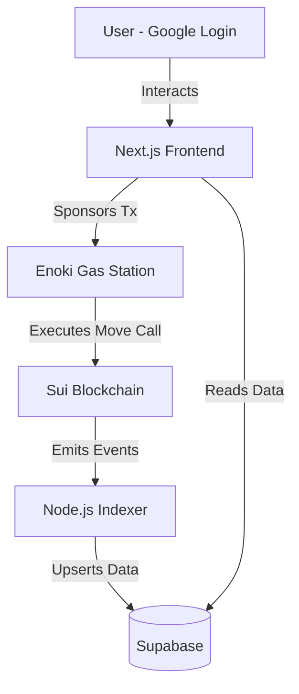

# Velax | Instant Refund NFT Auctions


**Velax** is a next-generation decentralized NFT auction marketplace built on **Sui**. It revolutionizes the auction experience by introducing **Atomic Instant Refunds** and a completely frictionless **Web2-like UX**.

---

## 🚀 Key Features

### 1. ⚡ Instant "Atomic" Refunds

In traditional auctions, if you are outbid, your funds are locked until you manually claim them.
In **Velax**, refunds happen **atomically in the same transaction block**.

- User A bids 1 SUI.
- User B bids 2 SUI.
- **User A is instantly refunded 1 SUI** automatically. No waiting, no claiming.

### 2. 🪄 Invisible Web3 (Enoki)

We removed the barrier to entry.

- **zkLogin:** Sign in with **Google**. No seed phrases, no wallet extensions required.
- **Gasless Transactions:** Users don't need SUI for gas. We sponsor all transactions using **Enoki Gas Station**.

### 3. 📡 Real-Time Indexer

A custom-built off-chain indexer listens to Sui blockchain events in real-time, ensuring the UI is always in sync with on-chain data without heavy RPC querying on the client side.

### 4. 🛒 Full Marketplace

- **Browse & Bid** - Discover NFT auctions from other users
- **Create Auctions** - List your NFTs with custom starting prices and durations
- **Dashboard** - Track your active bids, listings, and transaction history

---

## 🏗️ Architecture



### System Overview

```
┌─────────────────────────────────────────────────────────────────┐
│                    User (Google Login)                          │
└─────────────────────────────────────────────────────────────────┘
                              │
                              ▼
┌─────────────────────────────────────────────────────────────────┐
│                     Next.js Frontend                            │
│              (React, TypeScript, Tailwind CSS)                  │
├─────────────────────────────────────────────────────────────────┤
│  • Market Page      • Create Auction     • User Dashboard       │
│  • Real-time Bids   • Wallet Auth        • Transaction History  │
└─────────────────────────────────────────────────────────────────┘
                    │                           │
                    ▼                           ▼
┌───────────────────────────────┐   ┌─────────────────────────────┐
│      Enoki Gas Station        │   │     Supabase Database       │
│  • zkLogin (Google Auth)      │   │  • PostgreSQL               │
│  • Sponsored Transactions     │   │  • Real-time Subscriptions  │
│  • No wallet required         │   │  • Indexed Auction Data     │
└───────────────────────────────┘   └─────────────────────────────┘
                    │                           ▲
                    ▼                           │
┌─────────────────────────────────────────────────────────────────┐
│                      Sui Blockchain                             │
├─────────────────────────────────────────────────────────────────┤
│  • Move Smart Contracts       • Atomic Refund Logic             │
│  • NFT Auction Module         • Event Emissions                 │
└─────────────────────────────────────────────────────────────────┘
                              │
                              ▼
┌─────────────────────────────────────────────────────────────────┐
│                   Node.js Indexer (Railway)                     │
│         Polls blockchain events → Updates Supabase              │
└─────────────────────────────────────────────────────────────────┘
```

### Data Flow

```
User Login (Google) → zkLogin via Enoki → Ephemeral Keypair Generated
         │
         ▼
User Bids on Auction → Frontend builds TX → Enoki sponsors gas
         │
         ▼
Transaction executes on Sui → Atomic refund to previous bidder
         │
         ▼
Blockchain emits event → Indexer catches event → Supabase updated
         │
         ▼
Frontend reads Supabase → UI updates in real-time
```

---

## 🛠️ Tech Stack

| Category           | Technology                                      |
| ------------------ | ----------------------------------------------- |
| **Blockchain**     | Sui (Testnet)                                   |
| **Smart Contract** | Sui Move                                        |
| **Frontend**       | Next.js 15, TypeScript, Tailwind CSS, shadcn/ui |
| **Auth & Gas**     | Mysten Labs Enoki (zkLogin + Sponsored Tx)      |
| **Indexer**        | Custom TypeScript (Poller), hosted on Railway   |
| **Database**       | Supabase (PostgreSQL)                           |
| **Animations**     | Framer Motion                                   |
| **Icons**          | Lucide React                                    |

---

## 📁 Project Structure

```
velax/
├── velax-frontend/              # Next.js frontend application
│   ├── app/                     # App Router pages
│   │   ├── market/             # NFT auction marketplace
│   │   ├── create/             # Create new auction
│   │   ├── dashboard/          # User dashboard
│   │   ├── auction/[id]/       # Individual auction page
│   │   └── layout.tsx          # Root layout with providers
│   ├── components/
│   │   ├── layout/             # Navbar, Footer, AuthButton
│   │   └── ui/                 # shadcn/ui components
│   ├── lib/
│   │   ├── supabase/           # Supabase client config
│   │   ├── enoki/              # Enoki/zkLogin setup
│   │   └── utils.ts            # Helper functions
│   ├── scripts/
│   │   └── indexer.ts          # Blockchain event indexer
│   └── public/                 # Static assets
│
├── velax-contract/             # Sui Move smart contracts
│   ├── sources/
│   │   └── auction.move        # Atomic refund auction logic
│   └── Move.toml               # Move package config
│
└── README.md
```

---

## ⚙️ Setting Up Locally

Follow these steps to run the full stack (Frontend + Indexer) on your machine.

### Prerequisites

- Node.js 18+
- npm or pnpm
- Google account (for zkLogin)
- Sui CLI (for contract deployment)

### 1. Clone the Repo

```bash
git clone https://github.com/your-username/velax.git
cd velax
npm install
```

### 2. Environment Variables

Create a `.env.local` file in the root directory:

```env
# Supabase
NEXT_PUBLIC_SUPABASE_URL=your_supabase_url
NEXT_PUBLIC_SUPABASE_ANON_KEY=your_supabase_anon_key
# Use Service Role for Indexer (Keep secret!)
SUPABASE_SERVICE_KEY=your_service_role_key

# Enoki (Mysten Labs)
NEXT_PUBLIC_ENOKI_API_KEY=your_public_enoki_key
ENOKI_SECRET_KEY=your_secret_enoki_key

# Sui Contract
NEXT_PUBLIC_PACKAGE_ID=0xd1c395da20567fff79185d374be6d5d3f41fed6f4f0bb874c5ea198d803cd84c
NEXT_PUBLIC_SUI_NETWORK=testnet

# Google OAuth
NEXT_PUBLIC_GOOGLE_CLIENT_ID=your_google_client_id
```

### 3. Run the Indexer

The indexer listens for on-chain events and populates Supabase. Open a terminal:

```bash
# This will start the polling script
npx tsx scripts/indexer.ts
```

### 4. Run the Frontend

Open a second terminal:

```bash
npm run dev
```

Visit [http://localhost:3000](http://localhost:3000) to see the app.

---

## 📜 Smart Contract Details

The smart contract is deployed on **Sui Testnet**.

**Package ID:** `0xd1c395da20567fff79185d374be6d5d3f41fed6f4f0bb874c5ea198d803cd84c`

### Modules

| Function                  | Description                                                             |
| ------------------------- | ----------------------------------------------------------------------- |
| `auction::create_auction` | Mints a wrapped object and starts the timer                             |
| `auction::place_bid`      | Accepts payment, checks balance, and refunds previous bidder atomically |
| `auction::end_auction`    | Transfers the NFT to the winner and funds to the seller                 |

### How Atomic Refunds Work

```move
// Simplified Move logic
public entry fun place_bid(auction: &mut Auction, payment: Coin<SUI>, ctx: &mut TxContext) {
    let bidder = tx_context::sender(ctx);
    let bid_amount = coin::value(&payment);

    // Refund previous bidder atomically
    if (option::is_some(&auction.highest_bidder)) {
        let prev_bidder = *option::borrow(&auction.highest_bidder);
        let refund = coin::take(&mut auction.escrow, auction.highest_bid, ctx);
        transfer::public_transfer(refund, prev_bidder);  // ⚡ Instant refund!
    }

    // Accept new bid
    coin::put(&mut auction.escrow, payment);
    auction.highest_bid = bid_amount;
    auction.highest_bidder = option::some(bidder);
}
```

---

## 🧪 How to Test (Demo Flow)

1. **Login:** Use the "Connect Wallet" button to sign in with Google.

2. **Faucet:** Since it's Testnet, ensure your address has SUI (or transfer some from a Sui Wallet).

3. **Create:** Go to `/create` and list an item (e.g., duration 1 hour).

4. **Bid:** Go to `/market` and place a bid.

5. **Refund:** Open an Incognito window, login as a different user, and place a higher bid. Watch the first user get refunded instantly!

6. **Claim:** When the auction ends, go to `/dashboard` to claim your funds (as seller) or NFT (as winner).

---

## 🔧 Environment Variables Reference

| Variable                        | Description                        |
| ------------------------------- | ---------------------------------- |
| `NEXT_PUBLIC_SUPABASE_URL`      | Supabase project URL               |
| `NEXT_PUBLIC_SUPABASE_ANON_KEY` | Supabase anonymous key             |
| `SUPABASE_SERVICE_KEY`          | Supabase service role key (secret) |
| `NEXT_PUBLIC_SUI_NETWORK`       | Sui network (testnet/mainnet)      |
| `NEXT_PUBLIC_PACKAGE_ID`        | Deployed Move package ID           |
| `NEXT_PUBLIC_ENOKI_API_KEY`     | Enoki public API key               |
| `ENOKI_SECRET_KEY`              | Enoki secret key (server-side)     |
| `NEXT_PUBLIC_GOOGLE_CLIENT_ID`  | Google OAuth client ID             |

---

## 📱 Screenshots

_Coming soon_

---

## 🤝 Contributing

1. Fork the repository
2. Create your feature branch (`git checkout -b feature/amazing-feature`)
3. Commit your changes (`git commit -m 'Add amazing feature'`)
4. Push to the branch (`git push origin feature/amazing-feature`)
5. Open a Pull Reques

---

## 📄 License

This project is licensed under the MIT License - see the [LICENSE](LICENSE) file for details.

---

## 👥 Team

**Peters Joshua** - Full Stack Developer & Smart Contract Engineer
**Popoola Obaoluwa** - UI/UX designer & Project Manager

Built with ❤️ for the **Sui Ecosystem** and **Sui Hackathon 2025**

---

<p align="center">
  <strong>⚡ Velax — Bid Fast, Get Refunded Faster ⚡</strong>
</p>
